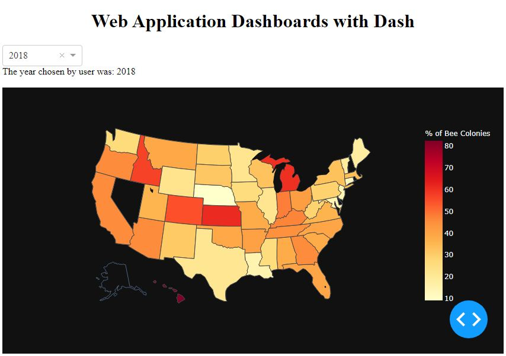

## Introduction to Dash Plotly
--------------

### About 
My first interactive dashboard based on the YT video from this [link](https://youtu.be/hSPmj7mK6ng).

#### 3 pillars of Dash which allows to build web based applications
1. Dash components:  
[dash.plotly.com/dash-core-components](https://dash.plotly.com/dash-core-components)  
Components needed to build interactive capability inside visualization dashboards.  
    * slider
    * checkbox
    * date picker
    * dropdown
2. Plotly Graphs:  
[plotly.com/python/](https://plotly.com/python/)  
Data visualization plots that allow user to visualize data.
    * map box
    * scatter plot
    * line chart
    * bar chart 
3. The Callback
Connects dash components with plotly graphs.  
[dash.plotly.com/basic-callbacks](https://dash.plotly.com/basic-callbacks)

Components and plotly graphs go into app layout and callback is outside app layout.